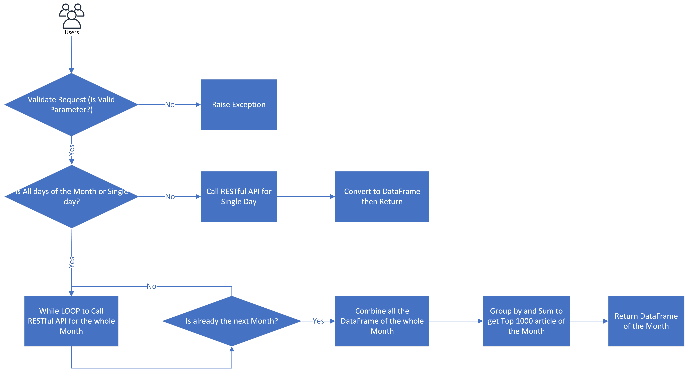

# wikipedia_api

## Project Motivation

Wikipedia provide a set of RESTful APIs to get Wikipedia's page view data. Users of these APIs can provide different Wikipedia projects they are interested in and specify date range as well as different filters such as access method, agent type etc. but there are some issues with the APIs.
  + Most of the parameters are in string format, such as the access method or agent type, which is error prone as typo or mis capitalization could happen
  + Some of the API could set hourly, daily, monthly granularity, but the date format specified required to pass in hour information even user didn't specify to get the data at hourly granularity level
  + Aggregated page view API has two version, one for legacy data from 12/01/2007 to 07/01/2015, while another API provide data after 07/01/2015, if user need to get data from after 12/01/2007 to a date after 07/01/2015, user will have to explicit call the two API separately and provide different set of parameters for access method or agent type
  + Top viewed article per country API only support daily granularity without monthly level support
  
 
## Project Ideas

This project is trying to provide a client library for the wikipedia page view APIs to address above issues.

## Design considerations

  + Encapsulate the detail calling Restful API and parsing of json data, with returned panda data frame that available for further processing
  + Initialize once wikipedia project and API headers without providing for each API call
  + Strong typed access method, agent type, granularity enumeration to avoid accident error
  + Strong typed request data structure for easy future extension or change if the underlying API changed to have more parameters
  + Flexible data range format support
  + Parameter validation with detail error result
  
  
## Usage

api_header = APIHeader(user_agent= 'https://github.com/IvyLinMS', call_from= 'ivylin@uw.edu')

api = WikipediaPageViewAPILib(api_header, "en.wikipedia")

request = TopViewedPerCountryRequest("US", AccessMethod.MOBILE_WEB, 2021, 2, 'all-days')

df = api.get_top_view_per_country(request)

## Project Components

[project structure](./diagram/ProjectStruture.jpg)
+ One function example <b>get_top_view_per_country</b>
     +  Lists the 1000 most viewed articles for a given country and date, across all projects. 
        Support filter by access method. Because of privacy reasons, pageview counts are given 
        in a bounded format and are not reported for certain countries. Furthermore, articles 
        visited by 1000 unique individuals or fewer on the given date will be excluded from the 
        returned data. Also, views produced by agents categorized as bots or web crawlers will 
        be excluded from all calculations, if all-days is specified in the day parameter, all data
        within the specified month will be returned
     +  

## Comparison
This Wikipedia API wrapper is to make an easy to use class for accessing Wikipedia page view API by providing unified API for page view aggregated data with set only once common parameters such as User-Agent and hide the detail of HTTP request construction, also provide top result per country on monthly level API which currently the Wikipedia API only support daily level.

Comparing to my [Data512 Wikipedia project](https://github.com/IvyLinMS/data-512-a1/blob/main/hcds-a1-data-curation.ipynb), this Wikipedia API wrapper is much more convenient for use. I wrote some code which is using both this Wikipedia API wrapper and the [Wikipedia page view API](https://wikitech.wikimedia.org/wiki/Analytics/AQS/Pageviews). Reference to https://github.com/IvyLinMS/wikipedia_api/blob/main/examples/wikipedia_api_examples.ipynb, the new interface is very clean with one simple call, which we encapsulate all the detail calling Restful API and parsing of json data, with returned panda data frame with a deep method.

## Learnings
For this project, I spent a lot of time for setting up continuous integration on this project, there're couple of learning here:
1. At first, I tried to setup Travis CI, but it never works https://app.travis-ci.com/github/IvyLinMS/wikipedia_api/branches
2. As an alternative solution, I switched to use GitHub Actions, it saved a lot of time for my manual testing.

Lesson learned I should setup the continuous integration at the beginning of my project, it will be easier at the early stage of the project lifecycle, and the cost will be much less than I setup in the middle of the project, it will save me a lot of cost for debugging and testing!

